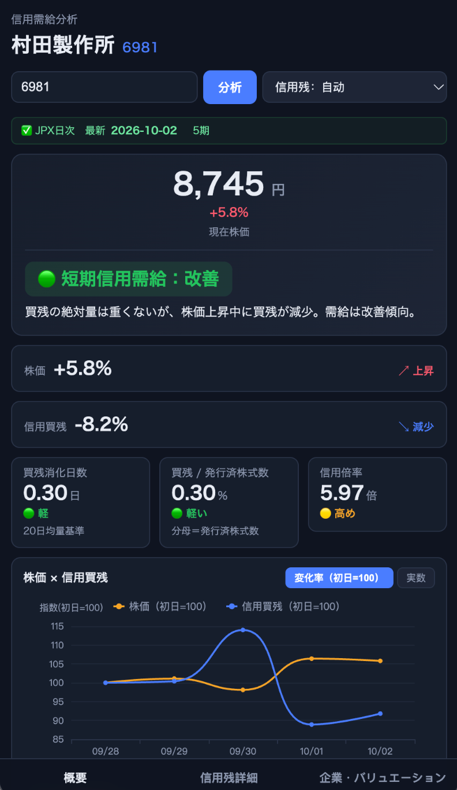
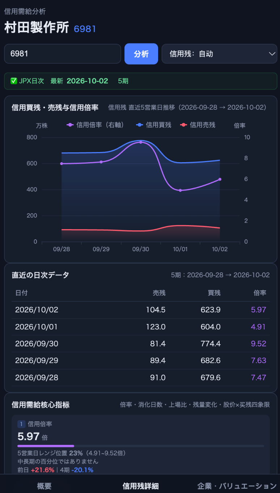
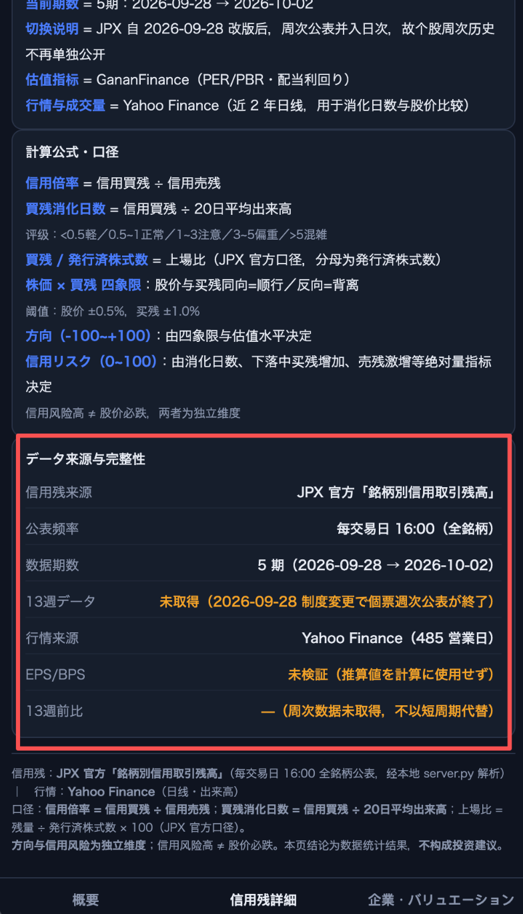

# 技术说明 · TECHNICAL

面向开发与审计：架构、信息层级与评分作用域、指标公式、日期对齐、分母可信度、公司行动 fail-safe、缓存与版本闸门、refresh 语义、本地 API 详细字段。

使用与安装请看 [README.md](../README.md)，测试请看 [TESTING.md](TESTING.md)。

## 目录

- [运行要求](#运行要求)
- [架构](#架构)
- [项目结构与核心文件](#项目结构与核心文件)
- [界面截图](#界面截图)
- [信息层级与评分作用域](#信息层级与评分作用域)
- [指标公式详细解释](#指标公式详细解释)
- [日期对齐与 look-ahead](#日期对齐与-look-ahead)
- [分母可信度（denominator confidence）](#分母可信度denominator-confidence)
- [公司行动 fail-safe（拆并股）](#公司行动-fail-safe拆并股)
- [缓存与并发安全（parserVersion）](#缓存与并发安全)
- [refresh 语义：generation / TTL / stale](#refresh-语义generation--ttl--stale)
- [本地 API 详细字段](#本地-api-详细字段)
- [数据口径补充](#数据口径补充)
- [常见问题](#常见问题)

## 运行要求

- Python **3.10+**；服务依赖 `pdfplumber`，安装范围见 `requirements.txt`。
- 支持 JavaScript、Fetch 与现代语法的桌面浏览器（Chrome / Edge / Safari）。
- 联网访问 JPX、Ganan、Yahoo 及公共代理。
- 一键启动脚本面向 macOS / Bash；端口检查使用 `lsof`，macOS 使用 `open` 打开浏览器。
- Node.js 18+ 仅用于运行回归测试，日常使用与 Python 打包不需要。

## 架构

```text
JPX 索引页 / PDF
        │
        ▼
server.py ── pdfplumber ── .cache/（本地缓存）
        │
        └── /api/margin ──────────────┐
                                     ▼
Ganan / Yahoo ── 公共代理 ── engine.js ── index.html
                                     │       │
                                     ▼       ▼
                                  engine2.js / ECharts
                                     │
                                     ▼
                          概要、明细、指标与规则解释

index.html + 四个本地 JS ── build.py ── 日股信用残分析.html
                                             ▲
                          server.py 的 / 与 /index.html 提供此成品
```

- `official.js`：浏览器到本地服务的连接层（含超时与重试）。
- `engine.js`：外部数据获取、基础解析、估值参考。
- `engine2.js`：信用指标、异常检测、评分规则、评级结论。
- `index.html`：整合数据与渲染界面。

本地服务的 `/` 与 `/index.html` 都提供**成品 HTML**，不单独提供开发版 JS 静态文件；修改后需重新打包。也可直接打开开发版 `index.html`，它会引用同目录 JS 并尝试固定 `8848` 端口的 API。

## 项目结构与核心文件

```text
margin-analyzer/
├── README.md                 # GitHub 首页：简介 / 安装 / 用法 / 限制 / Roadmap
├── CHANGELOG.md              # 版本记录
├── docs/
│   ├── TECHNICAL.md          # 本文件
│   ├── TESTING.md            # 测试与验收
│   └── screenshots/          # 界面参考截图
├── .gitignore
├── requirements.txt
├── start.sh                  # 本地环境检测、端口选择与启动
├── server.py                 # JPX PDF 获取、解析、缓存与 JSON API
├── index.html                # 开发版界面与数据整合
├── engine.js                 # 外部数据解析与估值辅助
├── engine2.js                # 信用指标、异常检测、评分规则
├── official.js               # 浏览器到本地服务的连接层
├── echarts.min.js            # ECharts 5.5.0，保留原始声明
├── build.py                  # 单文件构建及一致性检查
├── 日股信用残分析.html        # 已内联脚本的成品（发布入口，有意纳入版本控制）
├── test_*.mjs / test_*.py    # 回归测试
├── verify_ui.py              # 真实浏览器验收
└── licenses/
    ├── ECHARTS-LICENSE.txt
    └── ECHARTS-NOTICE.txt
```

`.cache/`、`__pycache__/`、虚拟环境、日志、密钥/环境文件及 `index_v3_backup.html` 由 `.gitignore` 排除，按需在本地保留。

## 界面截图

| 概要：需给判断与股价/买残走势 | 信用残明细：趋势与日次数据 | 数据来源、计算口径与完整性 |
| --- | --- | --- |
|  |  |  |
| [查看概要原图](screenshots/overview-6981.png) | [查看信用残明细原图](screenshots/margin-detail-6981.png) | [查看数据来源原图](screenshots/data-sources-6981.png) |

示例为 **6981 村田製作所**，信用残区间 2026-09-28 → 2026-10-02。截图属于截图时的版本，当前口径以本文为准。

## 信息层级与评分作用域

### 首页（概要）—— 目标是 5 秒看懂

| 顺序 | 内容 | 说明 |
| --- | --- | --- |
| 1 | 股票名 / 代码 / 当前股价 | 顶部涨幅位刻意留空，避免与「同期比较」混淆 |
| 2 | 信用需給总判断 | 只给等级：🟢 改善 / 🟡 中立 / 🟠 注意 / 🔴 悪化 |
| 3 | 信用ポジション | 軽い / 普通 / 重い 三档文字，**不给数字** |
| 4 | 信用残同期股价・信用買残 | 两个事实，各只出现一次 |
| 5 | 三个核心 KPI | 買残消化日数 / 買残÷発行済比 / 信用倍率 |
| 6 | 一句结论 | 只讲形态与轻重，不复述已出现的百分比 |
| 7 | 👀 注目 | 下一步该看什么 |
| — | 股价 × 信用買残 单图 | 默认「変化率（初日=100）」，共用单 Y 轴 |

首页**不出现**：方向分 / 风险分等 0~100 内部量、每条规则的贡献值、触发规则明细。同一事实在首页只出现一次（图下不再重复股价与买残的涨跌读数）。

### 信用需給 与 估值的边界

信用需給等级**只使用**信用交易自身指标：株価×信用買残方向、信用買残变化、信用売残变化、買残消化日数、買残÷発行済比 / 上場比、信用倍率。

**PER / PBR / EPS / BPS / 配当 / 估值区间一律不参与信用需給评分。** 估值高低不改变信用需給的好坏 —— 高估值股票不会因为「贵」被判成信用需給弱气。

### 詳細页结构

1. 信用買残 / 売残 / 倍率推移
2. 日次数据表
3. 消化日数の計算過程（可追溯到原始字段）
4. 上場比 / 発行済比 の詳細（分母口径与稳定性审计）
5. 信用需給核心指标总览
6. データ品質・異常検知
7. **この判定になった理由**（判定ロジック，默认折叠）
8. データ来源・公表时机 / 計算公式・口径

「判定ロジック」折叠区展开后显示方向分、信用风险分、每项贡献、触发规则，以及被**排除**在评分之外的估值信号 —— 用于在首页结论看起来意外时做审计。

### 相关函数（`engine2.js`）

| 函数 | 用途 | 调用方 |
| --- | --- | --- |
| `creditVerdict(ind, vr)` | 只返回等级 + badge + 信用ポジション，**不返回数字分数** | 首页 |
| `creditPosition(ind)` | 仓位三档（軽い/普通/重い） | 首页 |
| `verdictAudit(ind, vr, val)` | 内部分数 + 规则贡献 + 被排除的估值信号 | 詳細页折叠区 |
| `runRules(ind, val)` | 原始规则命中结果（0~100） | 内部中间层 |

评级结论的唯一来源是 `creditVerdict`：`buildWhy` 只引用 `reasonFacts`，不自行拼文案，避免结论与依据矛盾。

## 指标公式详细解释

| 指标 | 公式或逻辑 | 解读边界 |
| --- | --- | --- |
| 信用倍率 | `信用買残 ÷ 信用売残` | 倍率高可能由买残大或卖残少造成；单独不能判定涨跌或整体信用风险。 |
| 买残 / 卖残 | 内部原始单位为股；部分 UI 转换为万股（`÷ 10,000`） | 不同来源的频率、覆盖范围和股数口径应分别核对。 |
| 倍率绝对标签 | `<1` 売り長；`[1,3)` 均衡～良好；`[3,5)` やや高め；`[5,10)` 高め；`≥10` かなり高い | 当前代码的 UI 阈值，不是回测结论；3、5、10 的边界归入后一档。 |
| 区间位置 | 当前倍率在已获取样本的最小值与最大值之间的位置 | 是当前样本窗口的相对位置；不能自动解释成中长期百分位。 |
| 买残消化日数 | `最新买残 ÷ 平均日成交量` | 只取 `date ≤ 最新信用残日期` 且 `volume > 0` 的记录，最后 20 个有效记录为主口径；5–19 个时降级为最后 5 个，少于 5 个不计算。不是实际平仓期限。 |
| 买残 / 发行股数 | `买残 ÷ Ganan 発行済株式数 × 100%` | 无发行股数时回退 JPX 上場比，分母变为上市股份；不能称为浮动股或流通股占比。 |
| 股价 × 买残四象限 | 同期价格变化与买残变化的组合 | 信用数据样本决定比较跨度，缺行情时可用性受限；仅是观察框架。 |
| 信用风险与方向 | `engine2.js` 中显式规则及权重相加并截断 | 风险 0–100，方向 −100~+100；没有胜率、概率或收益率含义，未经过历史回测校准。 |
| PER/PBR、配当 | 源站展示值；估值参考由引擎另行计算 | 页面指标可能属于不同更新时点，须区分站点值、推算值和财报实值。 |

## 日期对齐与 look-ahead

- JPX 数据行以**申込日**标识；Yahoo 时间戳按 UTC 取交易日。
- 价格对齐**严格同日优先**，仅在缺失时向**过去**找最近交易日，**绝不接受 `priceDate > marginDate`**（旧实现会先找 +1 日，构成 look-ahead）。
- 每行记录 `marginDate` / `priceDate` / `isSameDate` 供审计。
- 无同期价格时四象限标记 `unknown`，不做跨期替代。
- 消化日数另有截止日过滤（只用不晚于最新信用残日期的成交量）。
- 价格与买残使用**同一个比较窗口**（`comparisonWindow`），避免「价格涨跌幅取 A 区间、买残变化取 B 区间」。

## 分母可信度（denominator confidence）

分母结构为 `{value, type, date, source, stable, confidence, diffPct, usableAsHardTrigger}`，分三档并直接影响评级：

| 档位 | 判定 | 影响 |
| --- | --- | --- |
| `high` | 与上場比交叉验证乖离 ≤ 20% | 可作为评级硬触发 |
| `unverified` | 无法验证（如上場比 < 1%） | 可作为硬触发，但显示口径说明 |
| `low` | 乖离 > 20%，有证据不可信 | **不得**作为评级硬触发，只作参考值并标注「分母可信度不足」 |
| `na` | 无分母 | 不参与 |

主口径「買残/発行済比」的分母是 Ganan **発行済株式数**；JPX「上場比」的分母是**上場株式数**，两者口径不同，页面严格区分、不混称。

## 公司行动 fail-safe（拆并股）

- 四象限优先使用 `adjclose`。**价格已复权，但 JPX 买卖残是实际股数、没有复权**，因此拆并股会让股数瞬间跳变（1 拆 4 → 買残 +300%）。
- 本工具**不猜拆股比例、也不自动修正数值**。
- 判定路径：
  1. **confirmed**：Yahoo `events.splits` 命中且事件日期落在比较窗口内（实测经代理可取到，285A 有 3:1 记录）。UI 文案用「株式分割・併合を検出」。
  2. **suspected（启发式）**：取不到事件数据时，遍历比较窗口内**所有相邻 pair**，若出现「买残跳变 > 50% 且复权价变动 < 20%」即命中。UI 文案用「株式分割・併合の可能性があります」。
- 命中后：`corporateActionAffected = true`，暂停 `buyChg` / `sellChg` / 四象限 / `long-surge` / `short-build` / 相关评级硬触发，等级降为 `unknown`，首页显示明确警示（`confirmed` 实线、`suspected` 虚线并标注启发式）。
- 状态透传链路：`R.corporateActionStatus` → `quadrant` → `creditVerdict` → `verdictAudit` → UI（`index.html` 的 verdict 对象同样携带该字段）。

## 缓存与并发安全

- 服务按 `code:days` 保存进程内结果（`MEM`），并缓存 PDF 与 JSON。
- JSON 缓存带 `schemaVersion` / `parserVersion` / `sourceFingerprint` / `parsedAt`；**解析逻辑变更后（parserVersion +1）旧缓存自动失效并重解析**，不再无条件吃旧 JSON。当前 `PARSER_VERSION = 4`、`SCHEMA_VERSION = 1`。
- `sourceFingerprint = code:day:PDF大小:PDF mtime`，用于确认「这份 JSON 是由这份 PDF 解析出来的」。
- 并发安全：
  - **per-date lock**：同一日期的 PDF 只允许一个线程下载 / 解析，其余等待后复用。
  - **原子写**：写入唯一 `.tmp` + `os.replace`，读者看不到半写文件。
  - **完整性校验**：`%PDF` 头 + `%%EOF` 尾 + 最小体积；坏文件不落正式名。
  - 下载失败 / PDF 不完整 / 解析异常的结果**不写入**磁盘缓存与进程缓存。
  - **generation**（`next_gen()`）：`fresh` 与普通请求并行时，旧请求不得覆盖新缓存。
- PDF 缓存无 TTL：PDF 不变就不重解析；JPX 修正历史数据并替换文件后需手动 `fresh=1`。

## refresh 语义：generation / TTL / stale

一次用户主动刷新前端最多发 3 次请求（`a=0/1/2` 重试链），**只有 `a=0` 带 `fresh=1`**；服务端另有 generation 兜底。

| 参数 | 值 | 含义 |
| --- | --- | --- |
| `UPSTREAM_TTL_FRESH` | 120s | 同轮 refresh（fresh 请求）内复用上游索引，只抓一次 |
| `UPSTREAM_TTL_WARM` | 600s | 普通请求复用窗口，避免每次查询都打 JPX |
| `UPSTREAM_ERR_TTL` | 30s | 抓取失败后的负缓存，避免连续重试放大延迟 |
| `UPSTREAM_LIMIT` | 40 | 索引最多保留的公表日数（API 上限 `days=40`） |

- `upstream_index(fresh, limit)` 返回 `(avail, meta)`；`meta.fetched=True` 表示这次真的抓了 JPX。
- **single-flight**：同一时刻只有一个线程抓上游，其余线程等它结束再复用。
- `fresh=1` 只重新解析**内容真的变了**的 PDF（按来源指纹判断），不再无条件重解析全部公表日 —— 实测单个 `mtall.pdf` 解析约 50s，这是旧实现「一次刷新 350s+」的根因。
- 失败处理：记 `err` 并保留旧索引作为降级数据，**绝不把它当成成功的 fresh**。

响应字段：

| 字段 | 含义 |
| --- | --- |
| `fresh` | 本次请求**是否要求**刷新（回显参数） |
| `freshServed` | 数据是否真的来自一次成功的上游刷新（降级时为 `false`） |
| `stale` | 是否用了「上游抓取失败后留下的旧索引」 |
| `upstream` | `{gen, fetched, reused, age, error, stale}`；`fetched=false` 表示复用上一轮 generation |

上游刷新失败且无数据可降级 → **HTTP 502** + `err`；有旧数据 → 200 但 `stale=true`，页面显示「缓存数据」告警。

## 本地 API 详细字段

```text
GET /api/health
GET /api/health?probe=1        # 显式探测 JPX（较慢）
GET /api/margin?code=7974&days=15
GET /api/margin?code=285A&days=15&fresh=1
```

### `/api/health`

只检查**本地服务存活与本地缓存**，成功时返回：

| 字段 | 说明 |
| --- | --- |
| `ok` | 服务是否在运行 |
| `service` / `parserVersion` / `schemaVersion` | 标识与缓存版本闸门 |
| `cachedPdfs` / `cachedRecords` | `.cache/` 中的 PDF 与 JSON 数量 |
| `jpxProbed` | 默认 `false` —— **不访问 JPX，不证明最新信用残可用** |
| `upstream` | 上游抓取计数：`indexFetches` / `indexReuses` / `indexErrors` / `parses` / `cacheHits`（纯本地计数，用于排查「一次 refresh 抓了几次」） |
| `note` | 「本接口仅检查本地服务与缓存，未验证 JPX 网络链路」 |

传 `probe=1` 时才真正抓取索引页，并回填 `availablePdfs` / `jpxProbed=true`；失败时 `ok=false` + `jpxError`。

### `/api/margin`

| 参数 | 说明 |
| --- | --- |
| `code` | 3~4 位数字 + 可选字母后缀（`7974` / `285A`） |
| `days` | 1~40，默认 20；只遍历索引页当前可见 PDF |
| `fresh` | `1` / `true` / `yes` 触发刷新语义（见上文） |

响应示例（结构说明，非实时结果）：

```json
{
  "ok": true,
  "code": "7974",
  "name": "任天堂",
  "rows": [
    { "date": "2026-10-01", "sell": 703700, "buy": 9145500, "ratio": 13.0 }
  ],
  "count": 1,
  "latest": "2026-10-01",
  "fresh": false,
  "freshServed": false,
  "stale": false,
  "upstream": { "gen": 1, "fetched": true, "reused": false, "age": 0.0, "error": null, "stale": false },
  "frequency": "日次（每営業日公表）",
  "parserVersion": 4,
  "source": "JPX 官方「銘柄別信用取引残高」（每交易日 16:00 公表）"
}
```

`rows[]` 每行含 `code / date / shortMD / sell / buy / ratio / sellChg / buyChg / sellListed / buyListed / negSell / stdSell / negBuy / stdBuy / name`。额外字段以实际响应为准。

## 数据口径补充

- **窗口随源站而变**：前端请求最多 15 个官方记录，服务接口允许 1–40 个，但不是完整历史数据库。
- **13 週比较**：当前 UI 整合路径没有注入周次历史比较，13 周前比保持为空，不用 13 天替代 13 周。底层遗留函数不代表页面已启用该能力。
- **估值参考不是历史真实估值**：PER 区间以当前 EPS（普通界面可能由当前价格/预测 PER 推算）除历史价格重建；缺行情时有 `0.84×` / `1.84×` 当前 PER 的启发式回退。
- **PBR 可靠性门槛**：PBR 基准价和区间只允许使用已验证的财报 BPS。当前 UI 未启用 J-Quants，也不传递财报验证状态，因此普通使用不应期待 PBR 基准价可用。
- **缺失与解析过滤**：零/非正买卖残、部分异常比值以及页面格式变更可能导致记录被过滤或查询失败，不保证覆盖所有股票、ETF、新股及极端状态。
- 健康接口可用 ≠ 所有标的都能解析成功。

## 常见问题

**查询首次很慢**：下载与逐页解析 PDF 耗时（单个 PDF 约 50s），换代码也可能触发解析。前端官方通道有有限重试，先确认本地服务日志，避免连续重复查询。

**官方源不可用**：确认服务已启动且地址/端口正确；`file://` 打开时只探测固定 `8848`。自动模式可能改用 Ganan，务必检查来源提示。

**页面数据没有更新**：JPX 索引可能尚未发布新文件；可请求 `fresh=1`，或重启服务刷新内存结果（磁盘文件仍会复用）。

**某个指标显示「—」**：可能是样本、成交量、发行股数或验证后的 EPS/BPS 缺失。不要把缺失当作零值或低风险证明。
